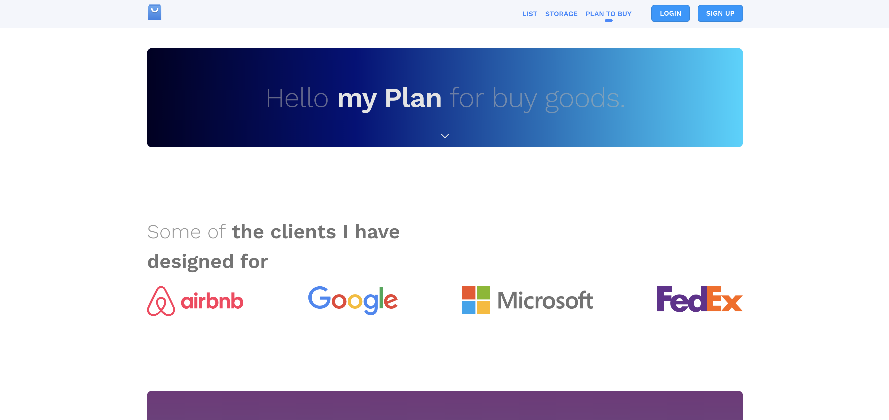
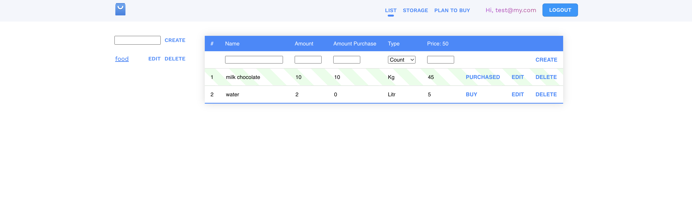

# buyshop-client

## Introduction

This repository hosts the source code for "buyshop-client", a React.js project designed as a demonstration for creating and managing shopping lists. This is demonstration code only; it is incomplete and not intended for full deployment or production use.

## Project Overview

"buyshop-client" is a web application that allows users to create and organize their shopping plans and lists efficiently. The app aims to facilitate the planning and purchasing processes by providing an interactive and user-friendly interface.

## Key Technologies

- **React.js**: Utilized as the main framework for building the user interface.
- **TypeScript**: Used to bring static typing to JavaScript, enhancing the development experience and reducing runtime errors.
- **Redux Toolkit**: Serves as the state management library, simplifying Redux usage for more predictable state.
- **React Router**: Manages the navigation between different views and components within the application.
- **Axios**: Employed for making HTTP requests to external APIs to fetch or store data.

## Screenshots

Below are some screenshots depicting the core functionalities of the application. These images are located in the `./screenshot` folder.

*Figure 1: Example of the shopping plan interface, where users can outline their shopping needs.*

*Figure 2: Example of creating a shopping list, where users can add items they intend to purchase.*

## Disclaimer

The provided source code is only intended for demonstration purposes. It showcases potential implementations in a React.js environment but is not configured for complete functionality.
